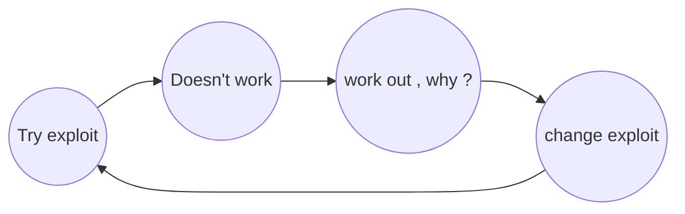

# Understand the Web App before Hacking

Hi! In this repo, we present a methodology on how to understand a web application before hacking or bug hunting.


## Understand the App and its feature?

First, try to use the web application as a normal user to understand the features it offers.

**Examples:**

-   Sell items
    
-   Chat with friends
    
-   Play games

Next, answer the following questions:
Then, answer the following questions:

1.  What does the app do?
    
2.  How do you use the app’s features?
    
3.  Record all the requests using Burp Suite and review them later.
    
4.  What can you do without logging in, and what requires authentication?  
    For example, you might be able to view a post but not like or comment on it without logging in.
    
5.  Record all the links you receive in the forword link, such as:
    ``` 
    https://www.foo.com/login.php?nextforword=main.foo.com
    ```

## What is a new feature? 

Is there a new feature in the application that has recently been added? Try to understand how it works and shed more light on it.

You are supposed to know all the features of the application and know how to use them. Usually, the subject is long and can take hours.

## Click ever bottoms!!

I can see what each button does. 

1. Do I have permission to use this button? 
2. Does it affect anything? 
3. Is this button interesting to me? 
4. Gather all disable buttons? 
5. What will the app do if I press a button more than once at the same time?

## What's an interesting endpoint ? 

We record and understand what each endpoint does, just the interesting only.
Such as fetching or sending data and performing a specific action within the application. 
We categorize endpoints based on the type of potential vulnerability, such as...! 
`uuid , id , user_id` classified under `IDOR`
`search , input , action , text` classified under `xss`

and save the path of endpoint like. 
`foo.com/profile?uid=123`

save endpoint that make statues change like or have a token. 
```
foo.com/auth/changepassword?uuid=12iu-asd9-kka1-0981

this endpoint chage password for user , based on uuid parameter
endpoint have a token his name : 
csrf = 0981jhkjhd987896938jlkja1787alpf

this token change after each refresh . 
this requst has a header to protect from csrf attacks ..!
refer : foo.com 
http-only : foo.com 
```

## Understand the components of the application

**Authentication** [JWT, Serialization, normal session]
**Forms** [endpoint, token, what's do, change statues?]

## In The End 

Answer the following questions: 
1. What is the primary function?
2. What are the types of users?
3. What is the sensitive endpoint? `deleted , paymat , add`
4. Can some steps be skipped? `write comment without logging in`
5. How is login performed?
6. Is there 2F-verification?
7. Does the email address be verified using a code or by email?

### When you started hunting, Remember that?
